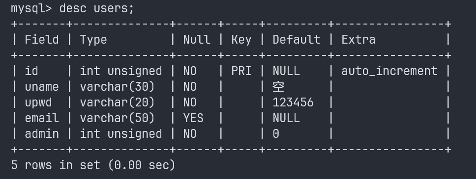

# 🎶Reop Server
## 😊简介：
本项目是基于Reop HTML 项目的单独后端项目，旨在替代Reop HTML后端
## 😉概述：
 - 本项目是`为了ReopHTMl项目而开发`的。在开发ReopHTML项目时，由于本人不了解后端技术，导致ReopHTML项目的后端部分过于臃肿，本项目是为了开发出更轻量化的ReopHTML后端。
 - 本项目依然使用`express框架`结构，但尽可能减少不必要的文件。
 - 本项目使用`mysql 8.0`作为主数据库。
 - Node.js 版本选择 `v22.5.1` 稳定版。
 - `nvm`做为nodejs的版本管理具。
 - `npm v10.8.2`作为本项目的包管理器
 ## 😎启动项目：
 1. 安装`node.js v22.5.1`
 2. 在`项目文件夹`下初始化项目
``` shell
> cd ./Reop Server project/
> npm init -y
```
3. 安装`依赖包`：

    name     | version
    -------- | -----
    cookie-parser | 1.4.6
    cors  | 2.8.5
    express-jwt | 8.4.1
    express|4.19.2
    jsonwebtoken|9.0.2
    morgan|1.10.0
    mysql2|3.1.1
    sequelize|6.37.3
``` shell
> npm install cookie-parser@1.4.6
> npm install cors@2.8.5
> npm install express-jwt@8.4.1
> npm install express@4.19.2
> npm install jsonwebtoken@9.0.2
> npm install morgan@1.10.0
> npm install mysql2@3.1.1
> npm install sequelize@6.37.3
```
- 如果npm下载过慢，请尝试更换下载源。


4. 运行项目命令
``` shell
> node app.js
或者
> npm run dev
```
- 此时还无法使用项目，需要链接到您的数据库。

## 💕链接数据库
1. 打开`model`文件夹下的`dbconfig.js`文件
2. 设置您的数据库`主机地址`，`端口号`，`数据库类型`,`密码`,`使用的数据库`
``` javascript
const DB = new Sequelize("onlinedb","root","123456",{
    host:"localhost",//主机地址
    port:3306,//数据库端口号
    dialect:"mysql",//数据库类型
    pool:{
        max:5,//最大链接数量
        min:0,//最小连接数量
        idle:10000,//10秒内没有调用，释放该链接
    },define:{
        timestamps:false
    },loggong:console.log//控制台输出日志
});
```
3. 链接到数据库后，您需要`根据您的需求调整映射表`
   - 打开`models`文件夹，打开`ueModel.js`,调整结构
``` javascript
//映射
const ueModel = DB.define("users",{//表名
    id:{//字段名
        primaryKey:true,//主键
        type:Sequelize.INTEGER,//数据类型INT
        field:"id",//自定义列名
        autoIncrement:true//自增
    },
    uname:{//字段名
        type:Sequelize.STRING(30),//定长STRING(30)
        allowNull:false,//不允许为空
        defaultValue:'空',//默认值
        field:"uname"//自定义列名
    },
    upwd:{//字段名
        type:Sequelize.STRING(20),//定长STRING(20)
        allowNull:false,//不允许为空
        defaultValue:'123456',//默认值
        field:"upwd"//自定义列名
    },
    email:{//字段名
        type:Sequelize.STRING(50),//定长STRING(50)
        defaultValue:null,//默认值
        field:"email"//自定义列名
    },
    admin:{//字段名
        type:Sequelize.INTEGER,//INTEGRE
        allowNull:false,//不允许为空
        defaultValue:'0',//默认值
        field:"admin"//自定义列名
    }
})
```
 - 或者您也可以创建一个和我一样的`数据库`和`表`。
1. 创建数据库：
``` sql
CREATE DATABASE onlinedb
USE onlinedb
```
2. 在`onlinedb`数据库中创建`users`表
``` sql
CREATE TABLE `users` (
	`id` INT(10) UNSIGNED NOT NULL AUTO_INCREMENT COMMENT '用户id',
	`uname` VARCHAR(30) NOT NULL DEFAULT '空' COMMENT '用户名' COLLATE 'utf8mb4_0900_ai_ci',
	`upwd` VARCHAR(20) NOT NULL DEFAULT '123456' COMMENT '密码' COLLATE 'utf8mb4_0900_ai_ci',
	`email` VARCHAR(50) NULL DEFAULT NULL COMMENT '邮箱' COLLATE 'utf8mb4_0900_ai_ci',
	`admin` INT(10) UNSIGNED NOT NULL DEFAULT '0' COMMENT '管理员',
	PRIMARY KEY (`id`) USING BTREE
```


## 😶‍🌫️设置密钥
 - 该项目涉及到`token`,`密文Cookie`。需要设置`您自己的密钥`。
 - 打开`app.js`,设置`SECRET_KEY`的`值`
 - 打开`routes`文件夹下的`main.js`,设置`SECRET_KEY`的`值`
``` javascript
const SECRET_KEY = 'REOPHTMLKEY';// key
```

## ❗错误处理
 - 如果您想调整错误类型返回的值，请打开`middleware`文件夹下的`errorhandle.js`文件
``` javascript
if (err.name === 'UnauthorizedError' && err.message === "No authorization token was found") 
    {
      code = 401
      message = '请登录'
    }else if (err.name === 'UnauthorizedError' && err.message === "jwt expired") {
      code = 401
      message = 'Token过期,请重新登录'     
    }
```

## 😁API：
功能描述|api地址|请求类型|是否需要token
-------|-------|-------|------------
登录|http://localhost:3000/api/login  |post|否
注册|http://localhost:3000/api/add  |post|否
更新信息|http://localhost:3000/api/update | put|否
删除|http://localhost:3000/api/delete|post|是
查询信息|http://localhost:3000/api/search|get|是 

## 📚LICENSE
``` test
MIT License

Copyright (c) 2024 clevebitr

Permission is hereby granted, free of charge, to any person obtaining a copy
of this software and associated documentation files (the "Software"), to deal
in the Software without restriction, including without limitation the rights
to use, copy, modify, merge, publish, distribute, sublicense, and/or sell
copies of the Software, and to permit persons to whom the Software is
furnished to do so, subject to the following conditions:

The above copyright notice and this permission notice shall be included in all
copies or substantial portions of the Software.

THE SOFTWARE IS PROVIDED "AS IS", WITHOUT WARRANTY OF ANY KIND, EXPRESS OR
IMPLIED, INCLUDING BUT NOT LIMITED TO THE WARRANTIES OF MERCHANTABILITY,
FITNESS FOR A PARTICULAR PURPOSE AND NONINFRINGEMENT. IN NO EVENT SHALL THE
AUTHORS OR COPYRIGHT HOLDERS BE LIABLE FOR ANY CLAIM, DAMAGES OR OTHER
LIABILITY, WHETHER IN AN ACTION OF CONTRACT, TORT OR OTHERWISE, ARISING FROM,
OUT OF OR IN CONNECTION WITH THE SOFTWARE OR THE USE OR OTHER DEALINGS IN THE
SOFTWARE.

```